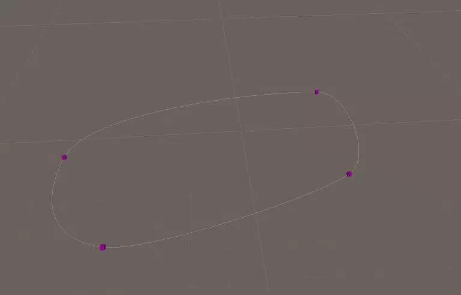

# Unity Bezier Curves / Editor Scripting

Some experiments with Unity Editor scripting and Bezier Splines. This code
draws some inspiration from the [Bezier Curve Editor](https://assetstore.unity.com/packages/tools/bezier-curve-editor-11278) Unity asset; especially borrowing the
technique to render _all_ handles even if a specific waypoint object is selected.

Implemented features:

- Game objects transforms as waypoints,
- Gizmos for rendering the curve outside the editor,
- Editor GUI handles for modifying control points,
- Re-using the same Editor GUI for both node and path components,
- Connected, symmetric and broken handles,
- Open and closed curves.

The inspector GUI dynamically generates the list of waypoints from the child
objects of the path and provides a context menu for appending and prepending
nodes, as well as clearing the path entirely.

Lastly, here's a video of the path being edited:

